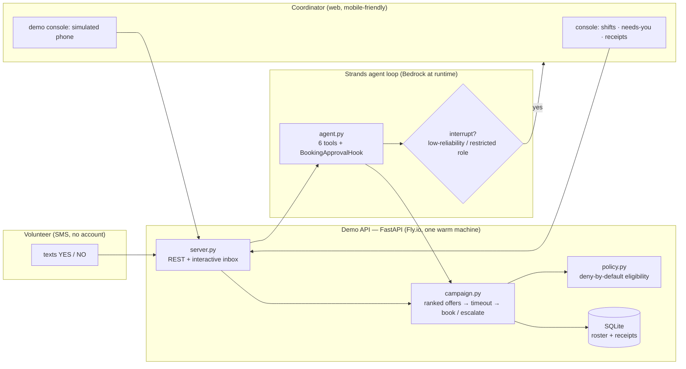

# wpilot — architecture



## Components

| Piece | What it does | Where |
|---|---|---|
| Console `/` | Shift cards, needs-you queue, receipt feed | `wpilot-ui/app/page.tsx` → Vercel |
| Demo console `/demo` | Simulated phone + trigger + reset | `wpilot-ui/app/demo/page.tsx` |
| Confirm `/confirm/[id]` | No-login volunteer accept page | `wpilot-ui/app/confirm/` |
| Demo API | Shifts, campaigns, inbox, offers, reset, agent run/answer | `wpilot-agent/src/wpilot/server.py` → Fly.io |
| Campaign engine | Deterministic backfill loop; safety rails enforced here, never in the prompt | `campaign.py` + `messaging.py` |
| Policy | Eligibility, adults-only default, ranking | `policy.py` (Cedar-shaped rules; Cedar-backed next) |
| Agent loop | Proposes; tools dispose; hook interrupts on judgment calls; sessions persist across restarts | `agent.py` (Strands) |
| Evals | 10 product-guarantee scenarios → `evals/report.md` | `wpilot-agent/evals/` |

## Key decisions

- **Deterministic core, agentic edge.** Schedule math, eligibility, dedupe,
  atomic booking, quiet hours, and ask caps are code. The LLM proposes order
  and wording, and handles the unexpected — it can never widen who gets
  texted or what gets booked.
- **Interrupts are the product.** `stop_reason == "interrupt"` + session
  persistence is how "runs in the background, surfaces when a human must
  decide" is implemented — not a chatbot with extra steps.
- **Receipts over dashboards.** Every action appends an immutable receipt;
  the coordinator UI is a clipboard, not a portal.
- **Demo honesty.** The simulated SMS channel is a real channel boundary:
  the engine cannot distinguish it from a real provider. Nothing is canned.
```

